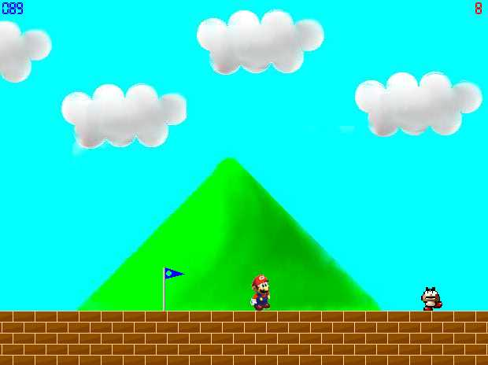

## Super Mario

### Description

An Incomplete Super mario game to demonstrate how to create games. Also shows the speed difference between Loop and Timer.
 
### More Info
 

             |
---                |---
**Submitted On**   |2002-03-23 15:14:04
**By**             |[Lefteris Eleftheriades](https://github.com/Planet-Source-Code/PSCIndex/blob/master/ByAuthor/lefteris-eleftheriades.md)
**Level**          |Intermediate
**User Rating**    |4.5 (50 globes from 11 users)
**Compatibility**  |VB 4\.0 \(32\-bit\), VB 5\.0, VB 6\.0
**Category**       |[Games](https://github.com/Planet-Source-Code/PSCIndex/blob/master/ByCategory/games__1-38.md)
**World**          |[Visual Basic](https://github.com/Planet-Source-Code/PSCIndex/blob/master/ByWorld/visual-basic.md)
**Archive File**   |[Super\_Mari647673232002\.zip](https://github.com/Planet-Source-Code/lefteris-eleftheriades-super-mario__1-32986/archive/master.zip)

